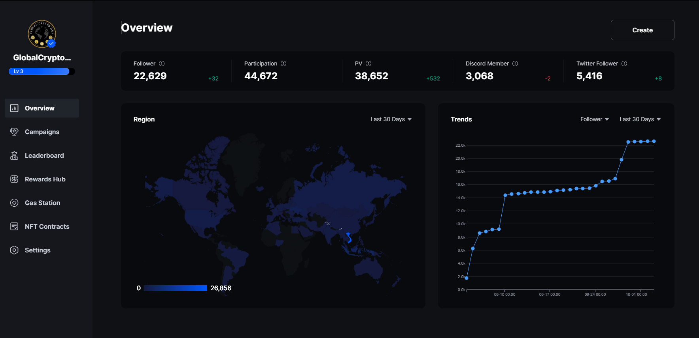

# 🎁 What do we offer?

Our platform provides an effortless way for users to discover new projects while getting rewarded for their involvement. With daily news coverage of the crypto and economic space, our users stay informed about market movements, chat with other crypto enthusiasts, and make friends, all in one place. Say goodbye to browsing the never-ending crypto rabbit holes and wasting time, and instead focus on what truly matters. Finding the best projects has never been easier!

For projects, joining our platform provides a unique opportunity to gain exposure to dozens of other communities, creating a loyal user base through our Showroom mechanism which involves quests, timed events and cross-collaboration campaigns between multiple projects.\
Unlike other platforms, we do not engage in pumping your project but rather foster organic growth through time-proven methods. Our incubation process ensures that only the most promising and credible projects are listed on our platform, guaranteeing that users are exposed to projects with genuine potential for success.

Our platform provides a one-stop-shop for all your crypto needs, allowing you to stay informed and engaged with the crypto market while discovering the best projects without any effort. For projects, joining our Showroom is a smart decision as it enables you to leverage our platform's strong user base and organic growth mechanics to foster your project's success. Join us as we revolutionize the way users and projects interact in the crypto market!\
\

<figure><figcaption>
Cross Collab Example
</figcaption></figure>

<figure><figcaption></figcaption></figure>
