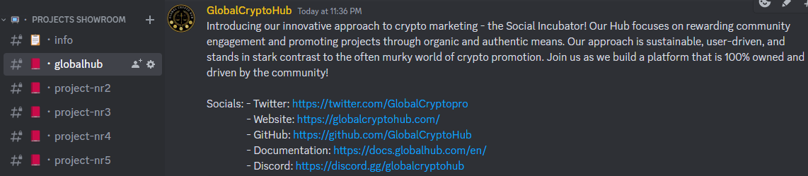

# 📺 Projects Showroom

The Projects Showroom is the heart of our Discord Hub, where Tenant Projects can gain exposure to a vast community of users. It is a space designed to help new and promising projects to grow and become successful.

Each project will have its own dedicated channel where the owner can communicate directly with our community, share updates, answer questions, and get valuable feedback. Our team will work closely with the project owner to ensure that the channel is set up correctly and that the project is well-positioned to gain maximum exposure.\
\
The Showroom can be used to gain exposure, test your product, gather feedback and create a community around your project. \

We understand that getting noticed in the crowded crypto space can be challenging, which is why we offer a wide range of quests, contests, and events for our community to participate in. Zealy and Galxe will be the primary platforms for these activities, and users will be rewarded for their engagement.\
\
After finishing social and quiz quests, users will be able to claim a discord role based on which they will be rewarded.\

<figure><figcaption>
Example of rented channel in the Showroom
</figcaption></figure>

## Renting space in the Projects Showroom

\
To rent a space, projects must pay a weekly fee. This is the minimum amount a channel can be rented for, to ensure that we can give projects the maximum exposure and for our community, time and flexibility to interact with the project.\
\
Renting price will depend on market conditions(Bull/Bear) and our own community numbers. Higher the engagement we can offer, the higher the asking price will be.\
\
We offer a maximum of 10 active slots to rent. We can increase or decrease the channels by holding a community vote. \
\
After the incubation period ends the rented channel will be hidden unless the Project Owners will extend the rent. They can always reactivate the Pool by providing rewards to gain exposure again.\
&#x20;

As we continue to grow and expand our services, we may consider working with non-crypto brands that want to explore the power of WEB3. With our Showroom, we are committed to helping projects find success and creating a vibrant, engaged community of users.
