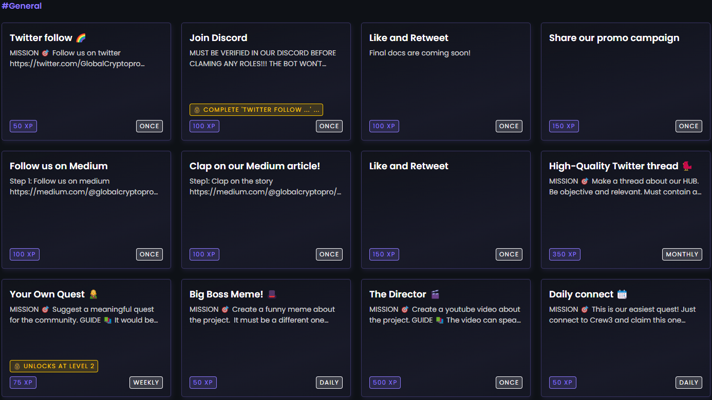

# 💵 Reward Pool

The Reward Pool is a mechanism designed to incentivize users to participate in various activities and earn rewards. \
\
The Pool is funded by 40% of the total rewards offered by a project or program. The rewards available in the Pool are distributed to users who have completed specific quests or achieved certain milestones like LVL 10 in Zealy.io which will offer the Jackpot role.\
The quests can range from following different Social Media channels to quizzes and riddles. \
\
The funds will be distributed to users at the end of each event. The timed events can range from one week to a maximum of four weeks. \
\
Users can view the available rewards at any time, ensuring transparency. The amount of rewards that a user can earn will depend on the size of the Pool and the number of users who have completed the same tasks. In some cases, there may be more users eligible for rewards than there are rewards available, and a raffle system could be used to distribute the rewards fairly.\
\
The Pool is a great way to motivate and reward users for their participation and can help to build trust and encourage wider participation in various programs.\
\

<figure><figcaption>
Example of quests for users.
</figcaption></figure>
