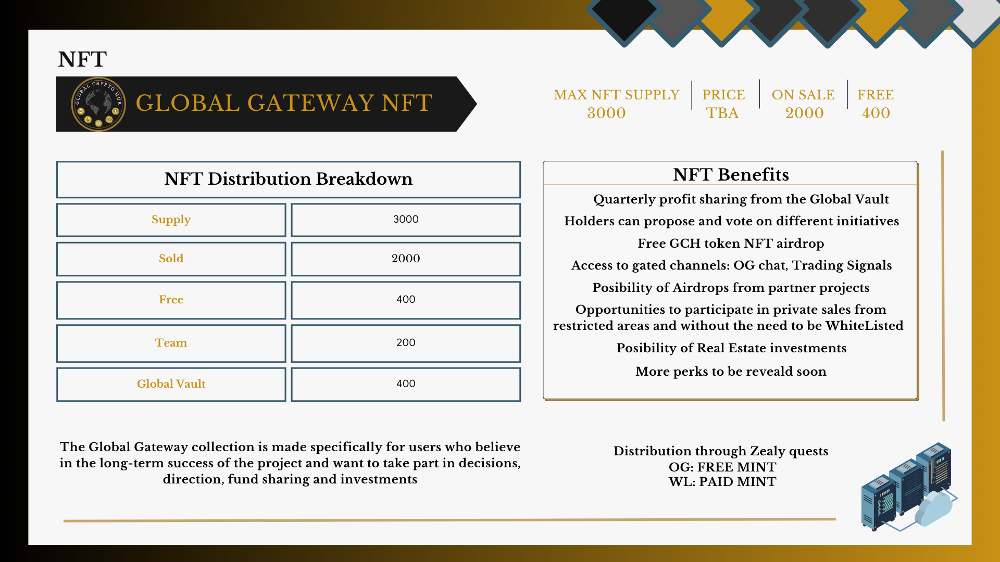

# 🎫 The Global Gateway NFT

SUPPLY: 3000 \
CHAIN: TBD\
PRICE: TBA\
TOTAL SOLD: 2000 \
FREE NFTs: 400 \
Global Vault: 400 \
Team and partners: 200 \

<figure><figcaption></figcaption></figure>

The Global Gateway collection is made specifically for users who believe in the project's long-term success and want to take part in decisions, direction and fund sharing.\
\
The first 200 NFTs can be acquired for FREE by the early community members for engaging with our Zealy questboard! \
To buy an NFT, you must acquire a WL role in our discord server.\
Our mint approach is organic and slow. Will take place in 10 phases spread over a longer period of time with 10 Free mints and 200 NFTs paid in each phase.\
\
\
**Holding and NFT will give the following benefits:**\
\
1\. Users can propose different initiatives and vote on the Hubs direction, profit sharing, investments, marketing..etc\
2\. Quarterly profit sharing from the Global Vault. Rules must be followed in order to make the initiative sustainable!\
3\. Free GCH Token NFT airdrop \
4\. Possibility of airdrops from partner projects\
5\. Access to private channels such as the OG chat, Trading Signals, and market insights\
6\. Opportunities to participate in private sales/NFT mints without the need to acquire a White List role. This perk is very helpful for people living in countries where participating in such events is forbidden.\
\

<figure><figcaption></figcaption></figure>
