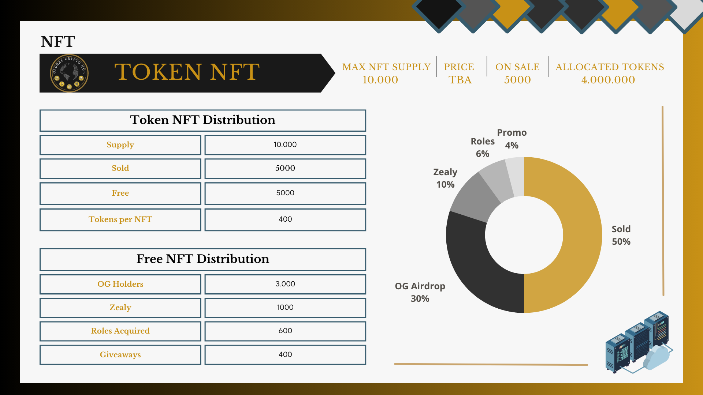

# 🪙 Token Details

**Name: GCH**\
Supply: 6.000.000\
Chain: TBD\
Token Price: TBA\
Initial circ supply: 960.000\
Initial MCAP: TBA\

<figure><figcaption></figcaption></figure>

**Token** **Distribution: 66% of the total supply through Token NFTs - 4.000.000**\
&#x20;                                        **34% of the total supply - GCH Token - 2.000.000**\
\
**Token NFT: 66% (4.000.000 GCH)**\
NFT Supply: 10.000\
Price per NFT: TBA\
Tokens per NFT: 400 GCH \
NFT breakdown: 5000 NFTs sold\
&#x20;                            3000 NFTs airdropped to the Global Gateway NFT holders \
&#x20;                            2000 NFTs Free\
\
**GCH Token: 34% (2.000.000 GCH)**\
Global Vault: 500.000 GCH\
Trading Pool: 500.000 GCH | TBA\
Team: 1.000.000 GCH\
\
**Free NFTs distribution:** Zealy leaderboard - 1000 NFTs\
&#x20;                                       Acquired roles - 600 NFTs\
&#x20;                                       Giveaways - 400 NFTs\

<figure><figcaption></figcaption></figure>

Our token, called GCH, serves as the primary currency for our project's ecosystem, providing means of incentivizing participation and rewarding our users for their contributions. \
\
The main use case of GCH is the payment of fees for projects to be listed in our Incubator. This approach allows us to create a sustainable revenue stream for our ecosystem while also ensuring that GCH remains the primary currency within our ecosystem. We accept any form of payment but will use it to buy back GCH tokens from the open market, thereby increasing the demand and value of our token.\
\
To further drive demand and increase value, we have implemented a Burn Mechanic. This mechanism involves a flat 10% fee of each incubated project being burned, which removes GCH from circulation and reduces supply. By reducing supply, we increase the value of the remaining GCH tokens and incentivize more users to hold onto their tokens rather than sell them.\
\
The token allocation strategy is designed to prioritize the interests of our community. We are airdropping 5000 Token NFTs with a total supply of 2.000.000 tokens distributed among our community.\
This approach ensures that early adopters and active community members are rewarded for their contributions. \
\
A further 5000 Token NFTs will be sold to fund the future development of the Hub.\
\
8.3% of the remaining tokens, will be used to open up a trading pool,  allowing the community members to trade GCH and further incentivize community engagement.\
\
To boost our [Global Vault](../core-features/global-vault.md), another 8.3% (500.000 GCH) will be allocated to it, raising the value of the Global Gateway NFT.\
\
The Team will keep 16.6 % of the total supply with 800k dedicated to the Core Team and 200k to the extended team, including everyone who worked on the development of the Hub for free. \

**Vesting**\
\
SOLD NFTS - 12% at TGE followed by linear vesting over 12 months\
(12% TGE - 48tokens/NFT) 240.000 tokens\
\
FREE NFTS - 6% at TGE followed by linear vesting over 18 months\
(6% TGE - 24tokens/NFT) 120.000 tokens\
\
Teams tokens - 10% at TGE followed by linear vesting over 18 months\
(10% TGE - 100.000 GCH tokens)\
\
Total tokens in circulation at TGE: 960.000 GCH

At the heart of our decentralization strategy is the recognition that our ecosystem's power lies in our community's hands. We believe that a strong and sustainable ecosystem can only be achieved through the active involvement of our community members. As such, we are committed to being driven by the needs of our community and projects, ensuring that we build a sustainable and prosperous marketing Hub for all.\
